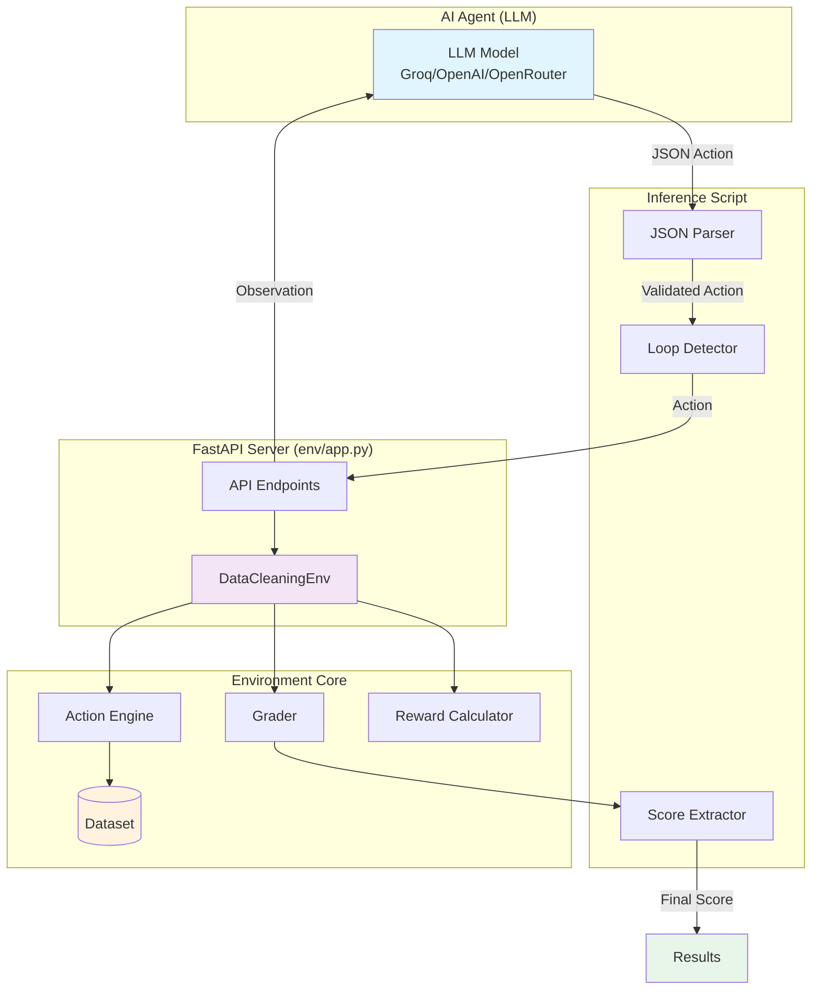
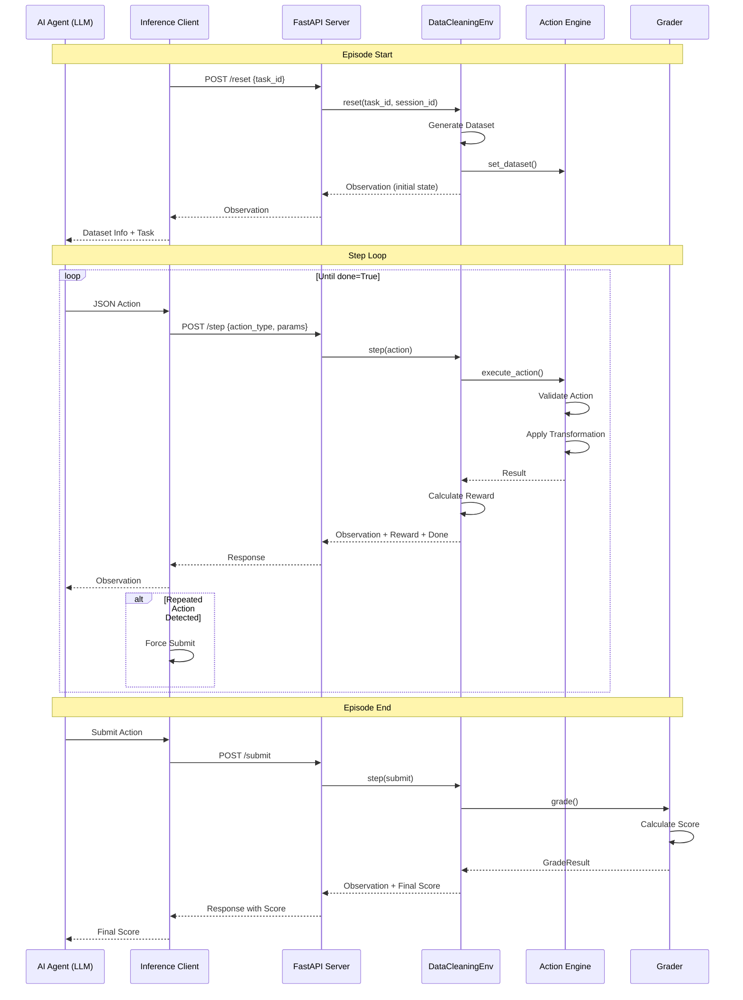
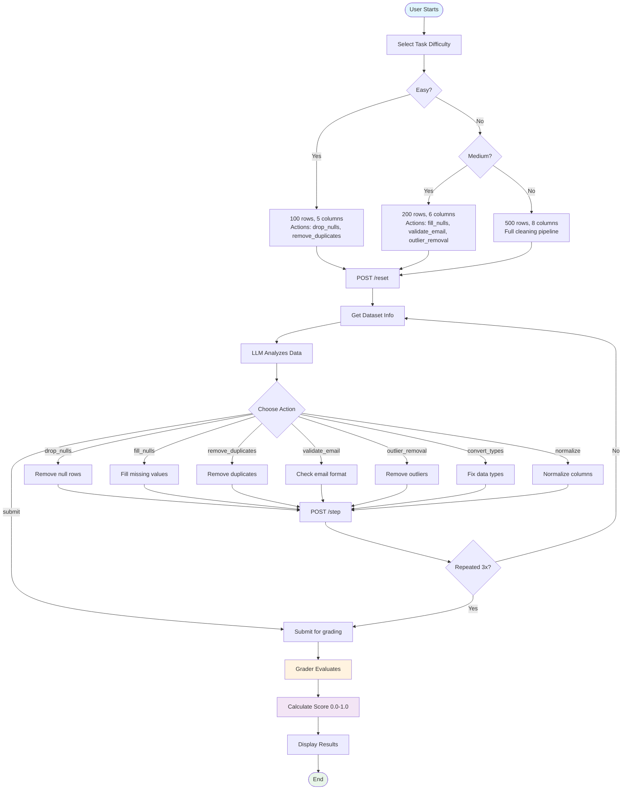

# OpenEnv Data Cleaner

An OpenEnv-compliant AI-powered data cleaning environment for training and evaluating AI agents on real-world data cleaning tasks.

---

## Environment Description

Data cleaning is a critical step in any data science or machine learning pipeline. Real-world datasets often contain missing values, duplicates, inconsistent formats, outliers, and other quality issues that can significantly impact downstream analysis and model performance.

This environment simulates a realistic data cleaning workflow where AI agents must identify and fix data quality issues through a series of targeted actions. The environment provides:

- **Realistic datasets** with common data quality problems
- **10 data cleaning actions** covering the most common cleaning operations
- **3 difficulty levels** from basic to advanced cleaning pipelines
- **Deterministic grading** with scores from 0.0 to 1.0
- **Shaped rewards** providing partial progress signals throughout the episode

## System Architecture




## OpenEnv Lifecycle Flow




## User Flow




## Action Space

The environment supports the following actions:


| Action              | Parameters                                                         | Description                      |
| ------------------- | ------------------------------------------------------------------ | -------------------------------- |
| `drop_nulls`        | `column` (optional)                                                | Remove rows with null values     |
| `fill_nulls`        | `column`, `strategy` (mean/median/mode/forward_fill/backward_fill) | Fill null values                 |
| `remove_duplicates` | `columns` (optional)                                               | Remove duplicate rows            |
| `filter_rows`       | `column`, `operator`, `value`                                      | Filter rows based on condition   |
| `drop_columns`      | `columns`                                                          | Remove specified columns         |
| `convert_types`     | `column`, `dtype` (str/int/float/datetime)                         | Convert column data types        |
| `validate_email`    | `column`, `drop_invalid` (bool)                                    | Validate email format            |
| `outlier_removal`   | `column`, `multiplier` (float)                                     | Remove outliers using IQR method |
| `normalize`         | `column`, `method` (minmax/zscore)                                 | Normalize numeric columns        |
| `submit`            | none                                                               | Submit solution for grading      |
| `revert`            | none                                                               | Revert last action               |


## Observation Space

Each observation contains:

- `dataset_info`: Current dataset metadata (shape, columns, null counts, dtypes)
- `available_actions`: List of valid actions
- `step_count`: Number of steps taken
- `task_id`: Current task identifier
- `message`: Status message
- `done`: Whether the episode is complete

## Task Descriptions


| Task ID      | Difficulty | Description                                                                         | Expected Actions                                                                                     |
| ------------ | ---------- | ----------------------------------------------------------------------------------- | ---------------------------------------------------------------------------------------------------- |
| `easy_001`   | Easy       | Basic cleaning: drop nulls and remove duplicates from a 100-row dataset             | drop_nulls, remove_duplicates                                                                        |
| `medium_001` | Medium     | Intermediate: handle nulls, validate emails, remove outliers from a 200-row dataset | fill_nulls, validate_email, outlier_removal                                                          |
| `hard_001`   | Hard       | Advanced: full pipeline with type conversion and normalization on a 500-row dataset | drop_nulls, fill_nulls, remove_duplicates, validate_email, convert_types, outlier_removal, normalize |


## Grading Criteria

Each task is graded on multiple criteria with weights:

- **easy_001**: null_handling (40%), duplicate_handling (40%), efficiency (20%)
- **medium_001**: null_handling (25%), email_validation (30%), outlier_handling (25%), efficiency (20%)
- **hard_001**: null_handling (15%), duplicate_handling (10%), email_validation (15%), type_conversion (20%), outlier_handling (20%), normalization (10%), efficiency (10%)

## Setup and Usage

### Prerequisites

- Python 3.10+
- Docker (for containerized deployment)

### Local Setup

```bash
# Navigate to the env directory
cd env

# Install dependencies
pip install -r requirements.txt

# Run the server
python app.py
```

The server will start on `http://localhost:7860`.

### API Endpoints


| Endpoint   | Method | Description                   |
| ---------- | ------ | ----------------------------- |
| `/`        | GET    | Web interface                 |
| `/health`  | GET    | Health check                  |
| `/reset`   | POST   | Initialize a new task         |
| `/step`    | POST   | Execute a cleaning action     |
| `/submit`  | POST   | Submit solution for grading   |
| `/revert`  | POST   | Revert last action            |
| `/tasks`   | GET    | List available tasks          |
| `/state`   | GET    | Get current environment state |
| `/dataset` | GET    | Get dataset information       |
| `/history` | GET    | Get action history            |


### Running the Inference Script

```bash
# Set environment variables
export API_BASE_URL="https://api.groq.com/openai/v1"
export MODEL_NAME="llama-3.1-8b-instant"
export HF_TOKEN="your_api_key_here"
export SPACE_URL="https://sairaj2-env.hf.space"

# Run inference
python inference.py
```

### Docker Deployment

```bash
# Build the Docker image
cd env
docker build -t openenv-datacleaner .

# Run the container
docker run -p 7860:7860 openenv-datacleaner
```

### Hugging Face Spaces Deployment

```bash
# Install openenv-core
pip install openenv-core

# Deploy
openenv push ./env

```

## Example or Testing of Inference.py with llama-3.1-8b-instant

```bash

python3 inference.py

[INFO] Starting inference with model=llama-3.1-8b-instant, base_url=https://api.groq.com/openai/v1
[START] task=easy_001 env=openenv-datacleaner model=llama-3.1-8b-instant
[DEBUG] Dataset info: shape=[100, 5], columns=['id', 'name', 'age', 'email', 'salary']
[DEBUG] Model response: {"action_type": "drop_nulls", "params": {"column": "name"}}...
[STEP] step=1 action={"action_type": "drop_nulls", "params": {"column": "name"}} reward=0.3407 done=False
[DEBUG] Model response: {"action_type": "drop_nulls", "params": {}}...
[STEP] step=2 action={"action_type": "drop_nulls", "params": {}} reward=0.4500 done=False
[DEBUG] Model response: {"action_type": "drop_nulls", "params": {}}...
[DEBUG] Detected repeated action, forcing submit
[STEP] step=3 action={"action_type": "drop_nulls", "params": {}} reward=1.6625 done=True
[END] success=True steps=3 score=0.7600 rewards=[0.3407, 0.45, 1.6625]
[START] task=medium_001 env=openenv-datacleaner model=llama-3.1-8b-instant
[DEBUG] Dataset info: shape=[200, 6], columns=['id', 'name', 'age', 'email', 'salary', 'department']
[DEBUG] Model response: {"action_type": "fill_nulls", "params": {"column": "email", "strategy": "mode"}}...
[STEP] step=1 action={"action_type": "fill_nulls", "params": {"column": "email", "strategy": "mode"}} reward=0.2194 done=False
[DEBUG] Model response: {"action_type": "fill_nulls", "params": {"column": "reward", "strategy": "mean"}}...
[STEP] step=2 action={"action_type": "fill_nulls", "params": {"column": "reward", "strategy": "mean"}} reward=0.0667 done=False
[DEBUG] Model response: {"action_type": "fill_nulls", "params": {"column": "reward", "strategy": "mean"}}...
[DEBUG] Detected repeated action, forcing submit
[STEP] step=3 action={"action_type": "fill_nulls", "params": {"column": "reward", "strategy": "mean"}} reward=1.2672 done=True
[END] success=True steps=3 score=0.7625 rewards=[0.2194, 0.0667, 1.2672]
[START] task=hard_001 env=openenv-datacleaner model=llama-3.1-8b-instant
[DEBUG] Dataset info: shape=[500, 8], columns=['id', 'name', 'age', 'email', 'salary', 'department', 'join_date', 'score']
[DEBUG] Model response: {"action_type": "drop_nulls", "params": {"column": "name"}}...
[STEP] step=1 action={"action_type": "drop_nulls", "params": {"column": "name"}} reward=0.1830 done=False
[DEBUG] Model response: {"action_type": "drop_nulls", "params": {}}...
[STEP] step=2 action={"action_type": "drop_nulls", "params": {}} reward=0.2714 done=False
[DEBUG] Model response: {"action_type": "drop_nulls", "params": {}}...
[DEBUG] Detected repeated action, forcing submit
[STEP] step=3 action={"action_type": "drop_nulls", "params": {}} reward=1.2237 done=True
[END] success=True steps=3 score=0.6527 rewards=[0.183, 0.2714, 1.2237]

============================================================
[SUMMARY] Baseline Results
============================================================
  easy_001: score=0.7600 steps=3 [PASS]
  medium_001: score=0.7625 steps=3 [PASS]
  hard_001: score=0.6527 steps=3 [PASS]

  Average Score: 0.7251
============================================================
```

## Baseline Scores


| Task        | Score      | Status |
| ----------- | ---------- | ------ |
| easy_001    | 0.7600     | ✅ PASS |
| medium_001  | 0.7625     | ✅ PASS |
| hard_001    | 0.6527     | ✅ PASS |
| **Average** | **0.7251** | -      |


## Project Structure

```
AutoClean-AI/
├── inference.py          # Baseline inference script
├── openenv.yaml          # OpenEnv configuration
├── README.md             # This file
├── .dockerignore         # Docker ignore patterns
└── env/                  # Environment package
    ├── __init__.py
    ├── app.py            # FastAPI server
    ├── client.py         # OpenEnv client
    ├── datacleaner_env.py # Main environment
    ├── Dockerfile        # Docker configuration
    ├── grader.py         # Grading system
    ├── inference.py      # HF Spaces entry point
    ├── models.py         # Data models
    ├── openenv.yaml      # OpenEnv config
    ├── pyproject.toml    # Dependencies
    ├── README.md         # Environment docs
    ├── requirements.txt  # Pip requirements
    ├── reward.py         # Reward system
    ├── tasks.py          # Task definitions
    └── static/
        └── index.html    # Web interface
```

---

## License

MIT License